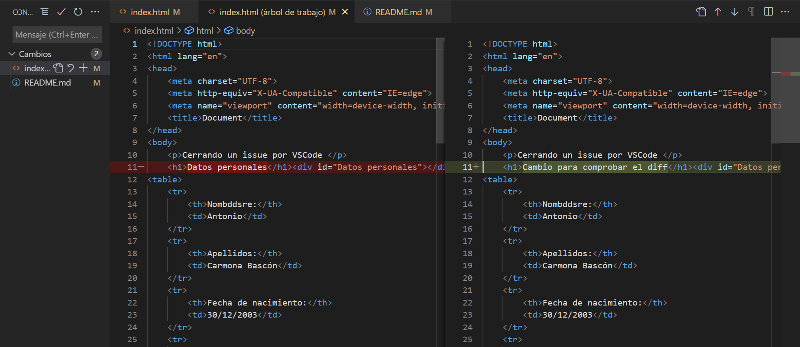
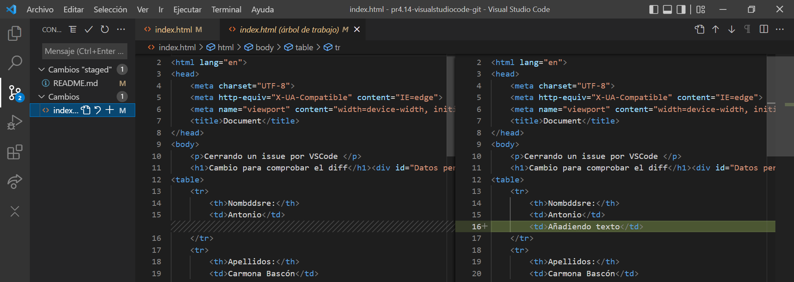
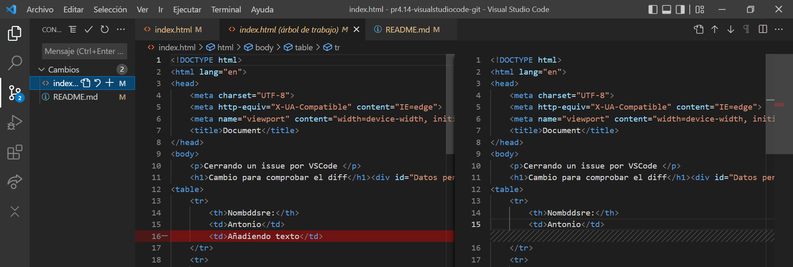
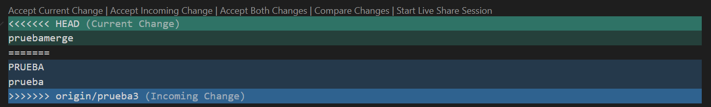

# practica4.14-visualstudiocode-git-Antoniocb03

Siguiendo con el tema de la documentación, utiliza el entorno de Visual Studio Code para utilizar el git.

Debes documentar lo siguiente:

**1. git add**

Git add se realizara de la siguiente forma:

Con esta opción añadimos los cambios.

**2. git commit cerrando un issue**

Primero: creamos el issue

Despues, cuando hayamos solucionado el issue y queramos guardarlo, añadimos el archivo que hayamos modificado y, **MUY IMPORTANTE**: a la hora de realizar el commit, le ponemos "close (identificador del commit)", el identificador del commit viene en el propio commit, en este caso es el #6 ya que estuve antes haciendo varias pruebas.

Ahora ya simplemente lo subimos

Y como podemos comprobar, el issue se ha cerrado

**3. git push**

Para realizar el git push, la opcion mas rápida es pinchar abajo a la izquierda a las dos flechas en forma de círculo.

Nos saldrá el siugiente mensaje, le damos a aceptar.

Y ya estarían sincronizados los cambios.

**4. git checkout -b documentacion**
Esto quiere decir crear una rama y movernos directamente a ella, yo en vez de documentacion le he dado a la nueva rama el nombre de "testbranch"

La forma que yo considero mejor es la siguiente:

Abajo a la izquierda sale en que rama estamos actualmente, clickamos sobre ella (que en mi caso es main) y nos aparecerá un menú en el que está la opción de "Crear rama". Le damos a crear y ponemos el nombre que queramos

Una vez creada la rama, se nos cambiará directamente (a la nueva rama la cual acabamos de crear)
La nube de la izquierda es para publicar dicha rama

**5. git merge** 
En este caso lo he realizado por la paleta de comandos:
La ruta es Ver>Paleta de comandos...> Git merge. (el acceso rápido para accerder a la paleta de comandos es Ctrl+Mayus+P)

Elegimos que rama queremos fusionar:

**6. git diff**
Git diff es el comando que usamos para visualizar las diferencias.
En VSCode, lo podemos hacer de la siguiente manera:

Simplemente hacemos click izquierdo sobre el archivo en el que hemor realizado algún cambio, y nos aparece en verde el cambio actual (el que se va a quedar) y en rojo el cambio antiguo (el que se va a cambiar por el nuevo).
Tambien podemos distingirlo porque en el que se va a eliminar aparece un "**-**" a la izquierda, y el que se va a añadir aparece un "**+**"

**7. git push**
Supongo que es  volver a hacer un push para comprobar que tal va todo. Ya he explicado antes en el ejercicio 3 el git push.

**8. Colores del margen del editor: rojo, verde azul**

Como ya he explicado en el ejercicio 6, el color rojo es lo que vas a eliminar, no necesariamente tiene que ser sobreescrito con algo (texto,imagenes...) simplemente puede ser eliminado y dejado en blanco.

El color verde, es simplemente lo que vas a añadir.
Si sobreescribimos texto por ejemplo, nos saldran los dos colores, ya que estamos eliminando un texto y escribiendo otro, pero si simplemente añadimos texto nos aparecera solo el color verde, y si eliminamos texto solo el color rojo

Sobreescribiendo:

Añadiendo texto

Eliminando texto:

El color azul sale cuando hay un conflicto en el merge, te da la opción de aceptar los cambios actuales, aceptar los cambios siguientes, o aceptar ambos. Una vez resuelto en conflicto, todo estará listo para realizar el merge

PD: Para enterarme un poco mejor del merge en el VSCode, yo he realizado algunas pruebas mas con ramas "prueba2","prueba3" como ya podrás ver en el Insights > Network.

