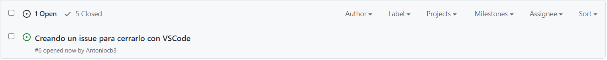

# practica4.14-visualstudiocode-git-Antoniocb03

Siguiendo con el tema de la documentación, utiliza el entorno de Visual Studio Code para utilizar el git.

Debes documentar lo siguiente:

**1. git add**

Git add se realizara de la siguiente forma:

Con esta opción añadimos los cambios.

**2. git commit cerrando un issue**

Primero: creamos el issue

Despues, cuando hayamos solucionado el issue y queramos guardarlo, añadimos el archivo que hayamos modificado y, **MUY IMPORTANTE**: a la hora de realizar el commit, le ponemos "close (identificador del commit)", el identificador del commit viene en el propio commit, en este caso es el #6 ya que estuve antes haciendo varias pruebas.

Ahora ya simplemente lo subimos

Y como podemos comprobar, el issue se ha cerrado

**3. git push**

Para realizar el git push, la opcion mas rápida es pinchar abajo a la izquierda a las dos flechas en forma de círculo.

Nos saldrá el siugiente mensaje, le damos a aceptar.

**4. git checkout -b documentacion**
Esto quiere decir crear una rama y movernos directamente a ella, yo en vez de documentacion le he dado a la nueva rama el nombre de "testbranch"

La forma que yo considero mejor es la siguiente:

Abajo a la izquierda sale en que rama estamos actualmente, clickamos sobre ella (que en mi caso es main) y nos aparecerá un menú en el que está la opción de "Crear rama". Le damos a crear y ponemos el nombre que queramos

Una vez creada la rama, se nos cambiará directamente (a la nueva rama la cual acabamos de crear)
La nube de la izquierda es para publicar dicha rama

**5. git merge** 
En este caso lo he realizado por la paleta de comandos:
La ruta es Ver>Paleta de comandos...> Git merge. (el acceso rápido para accerder a la paleta de comandos es Ctrl+Mayus+P)

Elegimos que rama queremos fusionar:

PRUEBA
prueba
**6. git diff**

**7. git push**

**8. Colores del margen del editor: rojo, verde azul**
